# ByeBye

## 👥 Miembros del Equipo
| Nombre y Apellidos           | Correo URJC                      | Usuario GitHub     |
|:-----------------------------|:---------------------------------|:-------------------|
| María Abdallah El Lakkis     | m.abdallah.2023@alumnos.urjc.es  | maria-242          |
| Yadira Reimundez Queimadelos | y.reimundez.2023@alumnos.urjc.es | yadirareimundez    |
| Vanessa Fernandes Franco     | v.fernandes.2023@alumnos.urjc.es | VanessaFernandes19 |
| Alejandro Hernández de Dios  | a.hernandezd.2023@alumnos.urjc.es|AlejandroHernández2805|
---

## 🎭 **Preparación: Definición del Proyecto**

### **Descripción del Tema**

Una aplicacion web interactiva del sector del turismo diseñada para que los viajeros descubran destinos y planifiquen sus viajes 
### **Entidades**
1. Usuario
2. Viaje
3. Reseña
4. Reserva


**Relaciones entre entidades:**
- Usuario - Viaje: Un usuario puede realizar en múltiples viajes (0:N)
- Viaje - Usuario: Un viaje puede ser realizado multiples usuarios (0:N)
- Usuario - Reserva: Un usuario puede hacer múltiples reservas (0:N)
- Reserva - Usuario: Una reserva pertenece a un usuario (1:1)
- Usuario - Reseña: Un usuario puede realizar múltiples reseñas (0:N)
- Reseña - Usuario: Una reseña pertenece a un usuario (1:1)


### **Permisos de los Usuarios**

* **Usuario Anónimo**: 
  - Permisos: Búsqueda de viajes por fecha y destino, darse de alta como
    usuario registrado y visualización de viajes recomendados y reseñas.
  - No es dueño de ninguna entidad

* **Usuario Registrado**: 
  - Permisos: Permisos: Búsqueda de viajes por fecha y destino, visualización de viajes recomendados y reseñas, darse de baja, gestionar perfil,
  gestionar reservas, gestionar reseñas y visualización de historial de viajes.
  - Es dueño de su perfil de usuario, de sus reseñas y de sus reservas.

* **Administrador**: 
  - Permisos: gestión de vaijes, de reservas, de viajes recomendados, moderación de contenido
   y visualizar estadísticas.
  - Es dueño de: usuarios, viajes, reseñas, y reservas.

### **Imágenes**

- **Usuario**: Una imagen de avatar 
- **Viaje**: Múltiples imágenes de cada viaje

### **Gráficos**

- **Visitas mensuales del usuario- Gráfico de barras**
- **Gastos mensuales del usuario- Gráfico de barras**
- **Viajes mensuales del usuario- Gráfico de barras**

- **Reseñas mensuales del viaje- Gráfico de barras**
- **Reservas mensuales del viaje- Gráfico de barras**
- **Plazas mensuales libres del viaje- Gráfico de barras**

### **Tecnología Complementaria**

- Envío de correos electrónicos automáticos mediante JavaMailSender
- Generación de PDFs de facturas usando iText o similar

### **Algoritmo o Consulta Avanzada**

- **Algoritmo/Consulta**: Sistema de recomendaciones basado en el historial de búsquedas del usuario y en las reseñas de cada viaje
- **Descripción**: Analiza los viajes reservados previamente y sugiere viajes similares o complementarios utilizando filtrado colaborativo.
- **Alternativa**: Consulta compleja que agrupe reservas por categoría, precio, fecha y destino, con cálculo de tendencias.

---

## 🛠 **Práctica 1: Maquetación de páginas web con HTML y CSS**

### **Diagrama de Navegación**
Diagrama que muestra cómo se navega entre las diferentes páginas de la aplicación:

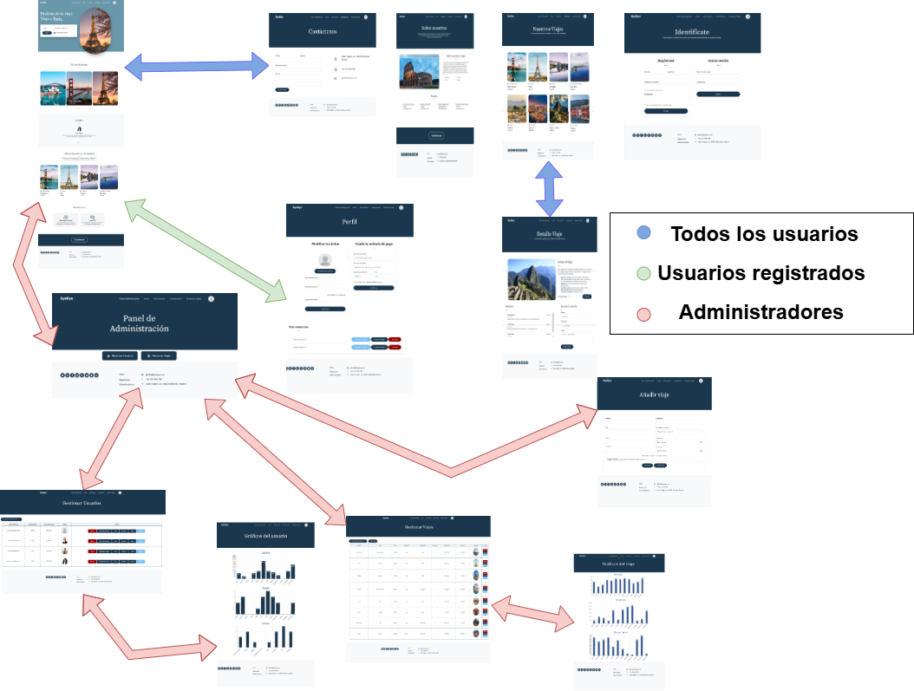

El flujo de navegación se divide en tres niveles de acceso. El usuario no registrado puede navegar por el catálogo de viajes y las secciones informativas. Al identificarse, el usuario desbloquea su perfil privado para gestionar datos personales y financieros. Por último, el rol de administrador tiene acceso a un ecosistema de gestión integral que incluye el control de la base de usuarios, la edición del catálogo de viajes y el acceso a paneles de métricas y estadísticas para la toma de decisiones.


### **Capturas de Pantalla y Descripción de Páginas**

#### **1. Página Principal / Home**
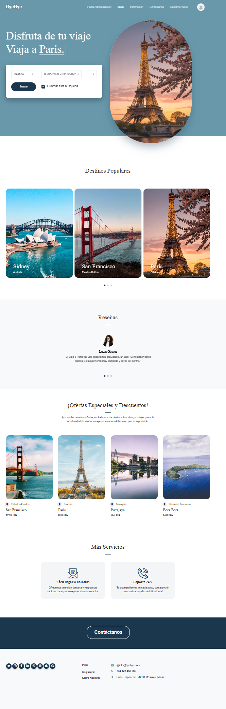

Página de inicio que muestra la primera página que se encuentra el usuario al entrar a nuestra web. En ella se puede observar un menú en la parte superior, el cual nos permite viajar a todas las páginas desde nuestra página de inicio. Lo más destacable de esta página es la sección en la que se le permite a el usuario poder seleccionar un viaje junto a la fecha y el nº de viajeros.
Justo debajo se puede apreciar un carrousel de fotos en las que aparecen los destinos más populares de nuestra web.
A su vez, el usuario puede encontrar una recopilación de las reseñas que han dejado los usuarios que han confiado en nosotros para su vaije.
Por último está el apartado de Ofertas especiales y decsuentos, en el que si el usuario desea hacer click en algun destino deseado, le lleva a la página de "Detalle de Viaje", en el que se le permitirá reservar su viaje, y leer o escribir reseñas.
#### **2. Página panel de administración**
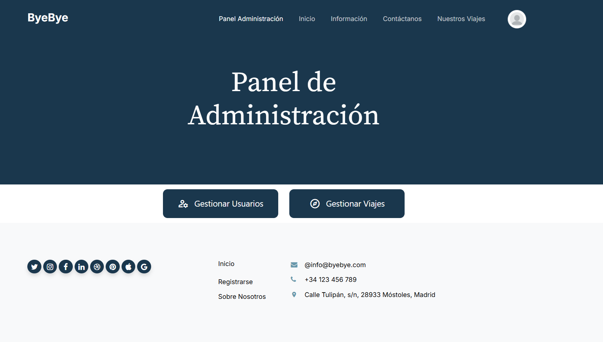

Página “Panel de Administración” que funciona como menú principal para el administrador, con accesos directos a gestionar usuarios y gestionar viajes. Incluye barra de navegación superior y footer con enlaces, redes sociales e información de contacto.

#### **3. Página Gestionar Usuarios**
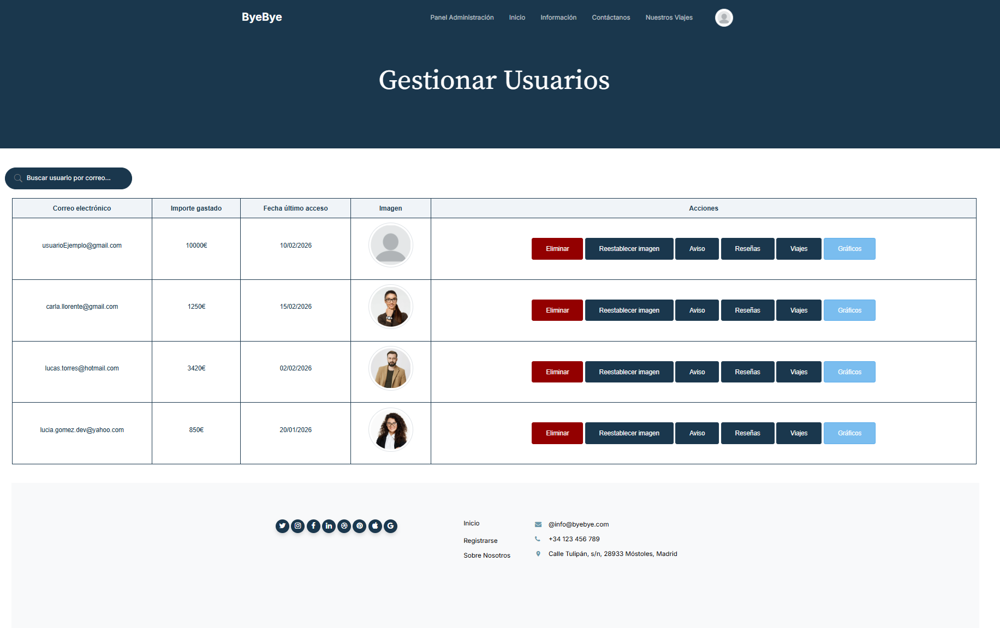

Página “Gestionar Usuarios” del panel de administración que permite buscar usuarios por correo y verlos en una tabla con información (email, importe gastado, último acceso e imagen). Incluye acciones para eliminar, restablecer imagen, enviar aviso y consultar reseñas, viajes y gráficos del usuario.

#### **4. Página Gestionar Viajes**
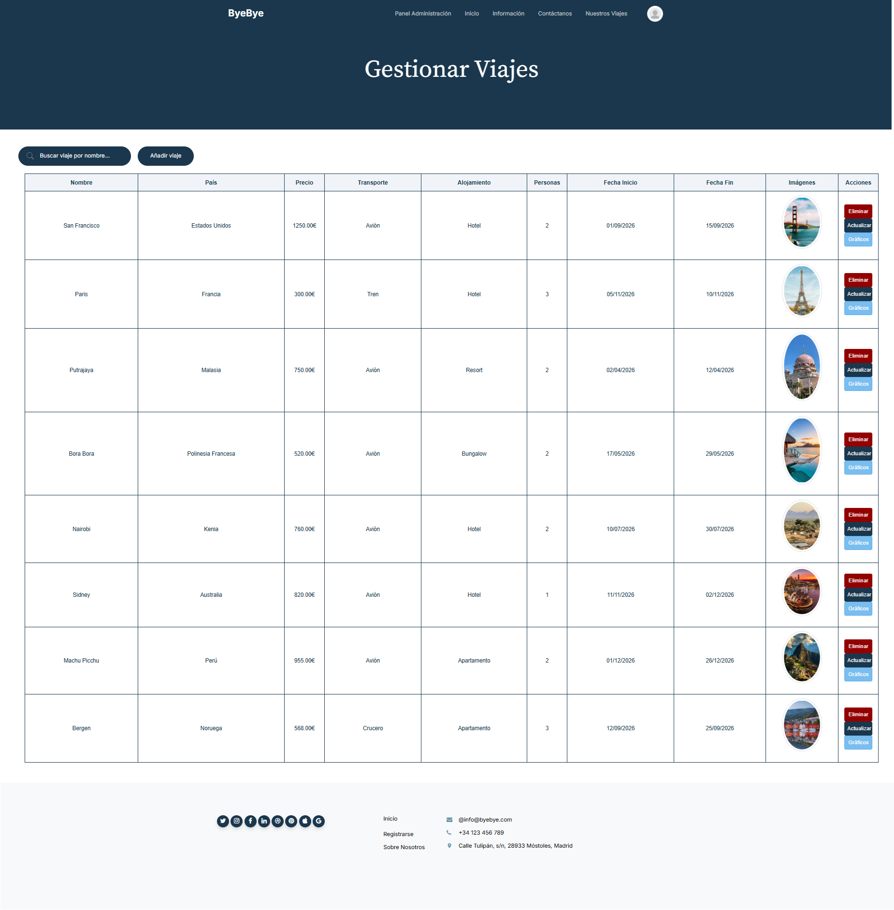

Página “Gestionar Viajes” del panel de administración que permite buscar y añadir viajes, y visualizar el listado en una tabla con datos (destino, país, precio, transporte, alojamiento, plazas, fechas e imagen). Incluye acciones para eliminar, actualizar y ver gráficos de cada viaje.

#### **5. Página Gráficos Usuarios**
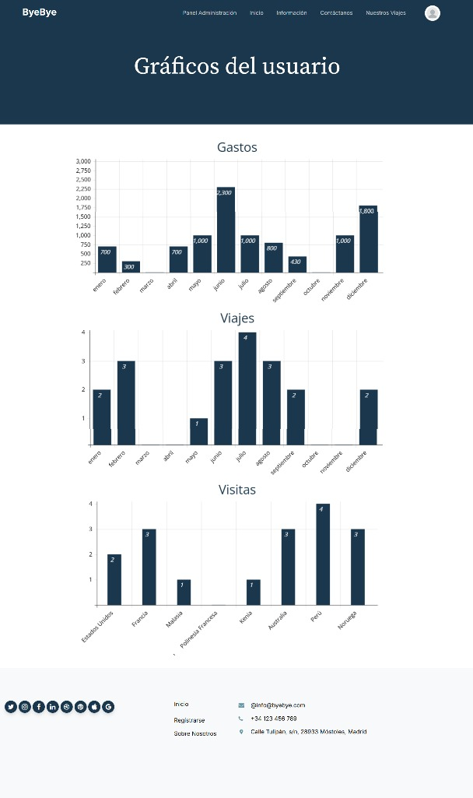

Página “Gráficos del usuario” que muestra estadísticas personales mediante gráficos de barras sobre gastos mensuales, número de viajes y visitas por destino. Incluye barra de navegación superior y footer con enlaces, redes sociales e información de contacto.

#### **6. Página Gráficos Viajes**
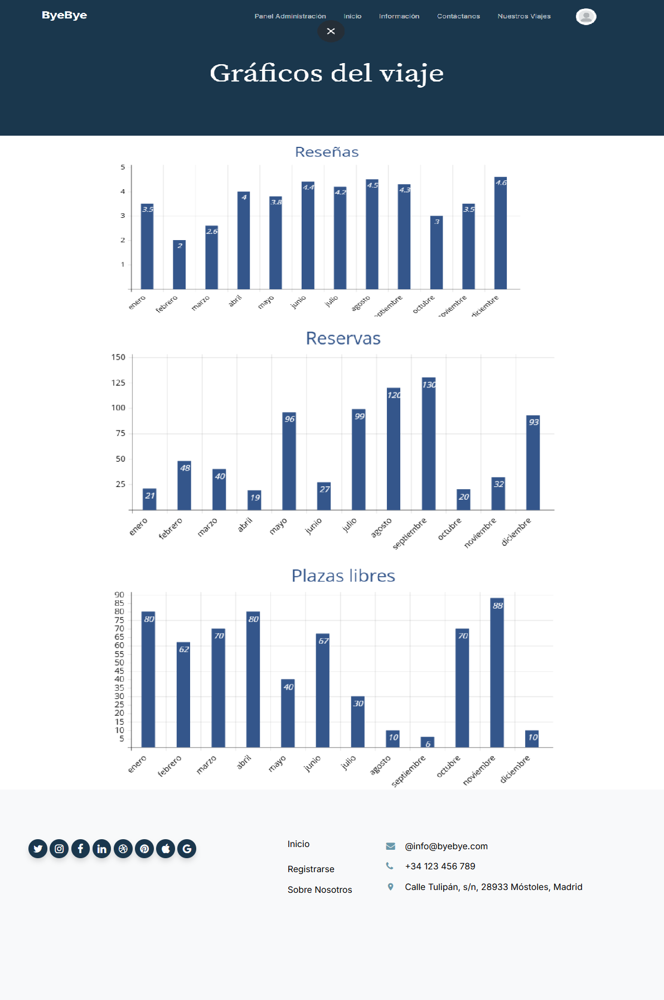

Página “Gráficos del viaje” que muestra estadísticas mensuales mediante gráficos de barras sobre reseñas, reservas y plazas libres. Incluye barra de navegación superior y footer con enlaces, redes sociales e información de contacto.

#### **7. Página información**
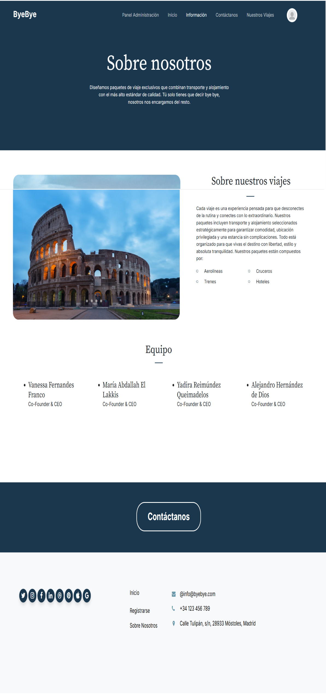
Página “Sobre nosotros” que presenta información sobre la empresa, los servicios de viajes que ofrece y el equipo fundador. Incluye navegación principal, sección de contacto y footer con enlaces e información de contacto.

#### **8. Contáctanos**
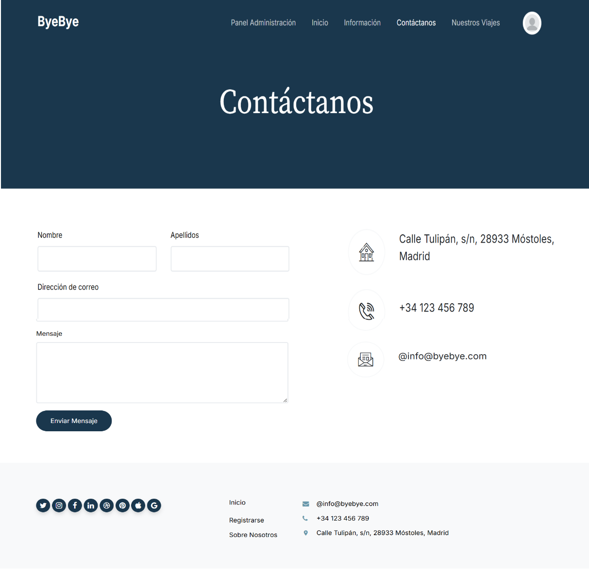

Página “Contáctanos” con formulario para enviar mensajes (nombre, apellidos, correo y mensaje) y datos de contacto de la empresa (dirección, teléfono y email). Incluye barra de navegación y footer con enlaces y redes sociales.

#### **9. Nuestros viajes**
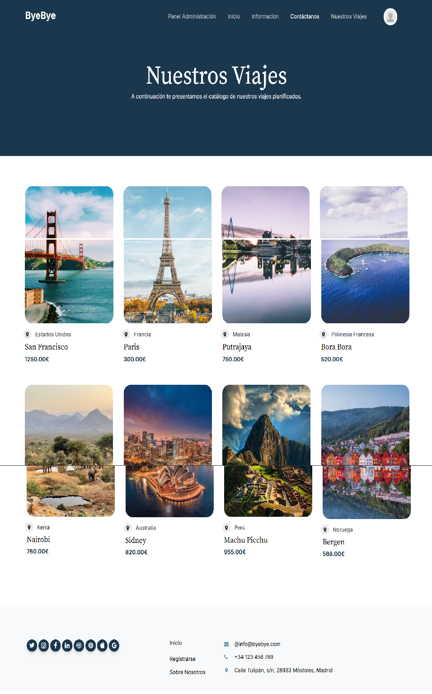

Página “Nuestros Viajes” que muestra el catálogo de viajes disponibles en formato tarjetas con imagen, país/destino y precio. Incluye barra de navegación superior y footer con enlaces, redes sociales e información de contacto.

#### **10. Detalle del viaje**
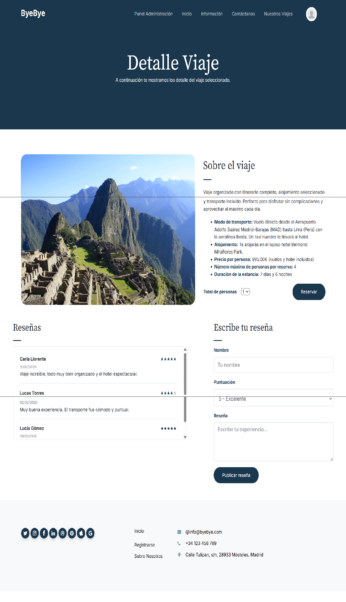

Página “Detalle Viaje” que muestra la información completa del viaje seleccionado (imagen, descripción, transporte, alojamiento, precio y duración) y permite reservar indicando el número de personas. Incluye sección de reseñas y formulario para publicar una reseña, con navegación y footer.


#### **11. Identifícate** 
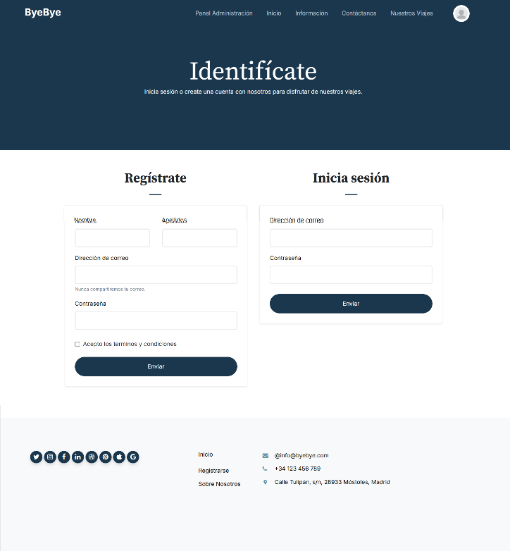

Esta página permite al usuario registrarse para crear una cuenta o iniciar sesión con sus credenciales. Presenta dos formularios específicos, adaptados según el perfil o tipo de usuario que desee acceder al sistema.

#### **12. Mi perfil**
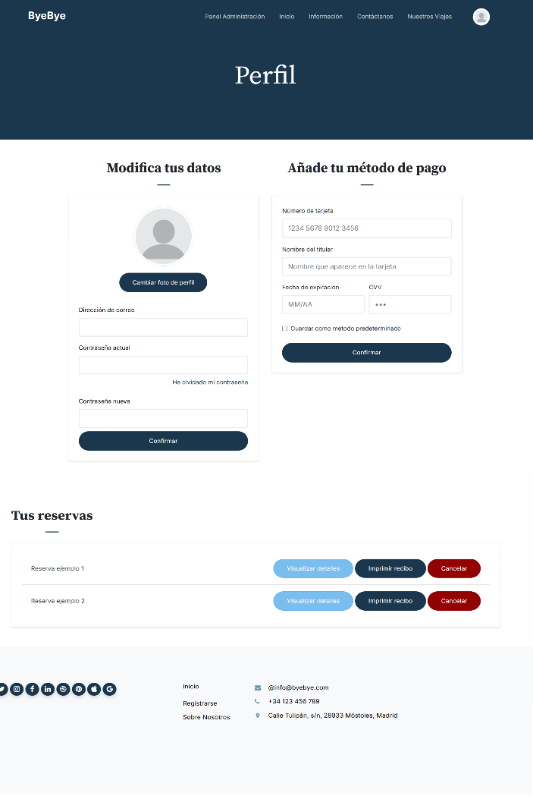

Esta es la página a la que puede acceder el usuario tras identificarse. Incluye dos formularios: uno para modificar sus datos personales y otro para gestionar sus métodos de pago. Además, presenta un listado de sus reservas con tres funciones clave: consultar los detalles del viaje, descargar el recibo en PDF y cancelar la reserva.  

#### **13. Añadir viaje** 
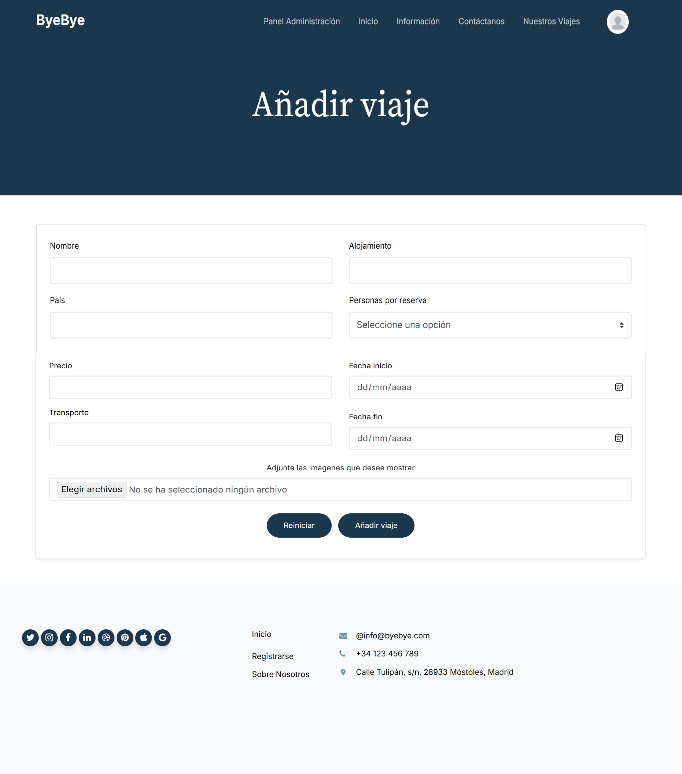

Esta página, accesible desde la sección de gestión de viajes del panel de administración, cuenta con un formulario diseñado para introducir todos los datos necesarios al crear un nuevo viaje.


### **Participación de Miembros en la Práctica 1**

#### **María Abdallah El Lakkis**

Mi responsabilidad principal se centró en el diseño y desarrollo del Panel de Administración, estructurando la gestión de usuarios y viajes en módulos independientes (admin.html, userManagement.html, journeyManagement.html). Asimismo, implementé con colaboración de Vanessa Fernandes la página de identificación (signin.html) y la sección Sobre Nosotros (about.html), asegurando la coherencia visual mediante la actualización de cabeceras en todas las páginas.

Complementé estas tareas con la creación de gráficos de usuario y trayectos para la visualización de datos. Además de estas funcionalidades clave, realicé una labor constante de mantenimiento y corrección de errores en diversas páginas del proyecto, optimizando el código y resolviendo fallos técnicos para garantizar la estabilidad y el correcto funcionamiento global de la aplicación.

| Nº    | Commits      | Files      |
|:------------: |:------------:| :------------:|
|1| [Identificación hecha](https://github.com/CodeURJC-SSDD-2025-26/practica-ssdd-2025-26-grupo-2/commit/c8e0dbd31ed37645b5ab96bb98a32b27bd88a95e)  | [signin.html](https://github.com/CodeURJC-SSDD-2025-26/practica-ssdd-2025-26-grupo-2/commit/c8e0dbd31ed37645b5ab96bb98a32b27bd88a95e#diff-3f706d449e7e721f0dcbe5c344f9ffd5a03e508fd94f0ab702f5f44fe83b4b09)   |
|2| [Sobre nosotros actualizado](https://github.com/CodeURJC-SSDD-2025-26/practica-ssdd-2025-26-grupo-2/commit/9958cdf782b09c3725e17a133caaf39597b9ae2f)  | [about.html](https://github.com/CodeURJC-SSDD-2025-26/practica-ssdd-2025-26-grupo-2/commit/9958cdf782b09c3725e17a133caaf39597b9ae2f#diff-df3150978f5fb18d5af7dfdf1ecf8f16ec617ef55839313a228015cd38456f64)   |
|3| [admin page avanzada y cambios en la cabecera de las páginas](https://github.com/CodeURJC-SSDD-2025-26/practica-ssdd-2025-26-grupo-2/commit/f9e827ccd6b4f00d75801ae199ec0d7d2cc4a001)  | [admin.html](URL_archivo_3)   |
|4| [Realización de gráficos de usuario y de viajes](https://github.com/CodeURJC-SSDD-2025-26/practica-ssdd-2025-26-grupo-2/commit/979265cc729d3831149510a6f3bcc529ef9771fa#diff-79f07eae294232fd92dbfa14398cb2e54ced757e1dcc4bda777688d00e763ca9)  | [graphUser.html](https://github.com/CodeURJC-SSDD-2025-26/practica-ssdd-2025-26-grupo-2/commit/979265cc729d3831149510a6f3bcc529ef9771fa#diff-79f07eae294232fd92dbfa14398cb2e54ced757e1dcc4bda777688d00e763ca9) [graphJourney.html](https://github.com/CodeURJC-SSDD-2025-26/practica-ssdd-2025-26-grupo-2/commit/979265cc729d3831149510a6f3bcc529ef9771fa#diff-be2ba4bc1915f55fbc69fe4fd3c2a91ae2dc841e5590bf3ee8d0e1bfc2855ee5)  |
|5| [separación gestión panel de administración y adición de usuarios y viajes](https://github.com/CodeURJC-SSDD-2025-26/practica-ssdd-2025-26-grupo-2/commit/0eac79eded2903a30d37ff91cd086d3ef97a0050)  | [admin.html](https://github.com/CodeURJC-SSDD-2025-26/practica-ssdd-2025-26-grupo-2/commit/0eac79eded2903a30d37ff91cd086d3ef97a0050#diff-92d2464dc932f171c36d255e0715278298ccc7c6607136069d1ab12daf09e9d2) [journeyManagement.html](https://github.com/CodeURJC-SSDD-2025-26/practica-ssdd-2025-26-grupo-2/commit/0eac79eded2903a30d37ff91cd086d3ef97a0050#diff-0d28112ec9f7e43ce3079baf272c8bc5016e926bbb377b343221cf03c7e47da2) [userManagement.html](https://github.com/CodeURJC-SSDD-2025-26/practica-ssdd-2025-26-grupo-2/commit/0eac79eded2903a30d37ff91cd086d3ef97a0050#diff-a3e0682a4f72dfc43a580237f975b348d14b3e7bda21471633f74dcf008c8d44)   |

---

#### **Vanessa Fernandes Franco**

 He sido responsable del desarrollo de funcionalidades del sistema, destacando la implementación de la página signin y about en colaboración con Maria Abdallah y la creación de la página destinada a la gestión de nuevos viajes (addJourney.html).

Asimismo, me he encargado de la creación y actualización de la pagina userProfile. Por último, he aportado mejoras en la navegación global mediante el rediseño de la cabecera de todas las páginas. 

| Nº    | Commits      | Files      |
|:------------: |:------------:| :------------:|
|1| [Identificación hecha](https://github.com/CodeURJC-SSDD-2025-26/ssdd-2025-26-project-base/commit/c8e0dbd31ed37645b5ab96bb98a32b27bd88a95e)  | [signin.html](https://github.com/CodeURJC-SSDD-2025-26/ssdd-2025-26-project-base/commit/c8e0dbd31ed37645b5ab96bb98a32b27bd88a95e#diff-3f706d449e7e721f0dcbe5c344f9ffd5a03e508fd94f0ab702f5f44fe83b4b09)   |
|2| [Administración usuario hecha](https://github.com/CodeURJC-SSDD-2025-26/ssdd-2025-26-project-base/commit/a49353f4a1cc56d6b561aa44e9835d6eb102dada)  | [userProfile.html](https://github.com/CodeURJC-SSDD-2025-26/ssdd-2025-26-project-base/commit/a49353f4a1cc56d6b561aa44e9835d6eb102dada#diff-73e533bdb927092e964048aa4f7e79746b9423274e10a92f728cc97e6414f990)   |
|3| [Sobre nosotros actualizado](https://github.com/CodeURJC-SSDD-2025-26/ssdd-2025-26-project-base/commit/9958cdf782b09c3725e17a133caaf39597b9ae2f)  | [about.html](https://github.com/CodeURJC-SSDD-2025-26/ssdd-2025-26-project-base/commit/9958cdf782b09c3725e17a133caaf39597b9ae2f#diff-df3150978f5fb18d5af7dfdf1ecf8f16ec617ef55839313a228015cd38456f64)   |
|4| [Cambio cabecera y cambio userProfile](https://github.com/CodeURJC-SSDD-2025-26/ssdd-2025-26-project-base/commit/1579be1649fc36757070903c1b6bfcee4596b08f#diff-73e533bdb927092e964048aa4f7e79746b9423274e10a92f728cc97e6414f990)  | [userProfile.html](https://github.com/CodeURJC-SSDD-2025-26/ssdd-2025-26-project-base/commit/1579be1649fc36757070903c1b6bfcee4596b08f#diff-73e533bdb927092e964048aa4f7e79746b9423274e10a92f728cc97e6414f990)   |
|5| [Pagina añadir viaje hecha](https://github.com/CodeURJC-SSDD-2025-26/ssdd-2025-26-project-base/commit/ebe64b335f5425de9cab48867b3d3abcafa2bb29)  | [addJourney.html](https://github.com/CodeURJC-SSDD-2025-26/ssdd-2025-26-project-base/commit/ebe64b335f5425de9cab48867b3d3abcafa2bb29#diff-783078f9c4cba9e60d8a68a0744b3420dfcaa74f60407fa0b80fa6d032c5b65c)   |

---

#### **Yadira Reimúndez Queimadelos**

Durante el desarrollo del proyecto, trabajé en pareja con mi compañero Alejandro en la creación de las secciones “About” y “Contáctanos”, encargándonos del diseño, estructura y contenido de ambas páginas.

De manera individual, me encargué de la creación de la travel_page y su correspondiente extensión travel_page, asegurando su correcto funcionamiento e integración dentro del sitio web. Asimismo, llevé a cabo pequeñas modificaciones en el estilo de otras páginas para mantener una estética coherente y mejorar la presentación general del proyecto.

| Nº    | Commits      | Files      |
|:------------: |:------------:| :------------:|
|1| [travel_page hecha y extensión empezada](https://github.com/CodeURJC-SSDD-2025-26/ssdd-2025-26-project-base/commit/f0fe1e94088aaf6c20d0fa60d920ad746e5cd9d4)  | [travel_page.html](https://github.com/CodeURJC-SSDD-2025-26/ssdd-2025-26-project-base/commit/f0fe1e94088aaf6c20d0fa60d920ad746e5cd9d4#diff-3b8bbed1a7bd7d1560b86584af93fedcf6f69fe58a1630acb96467c308bc0cff)   |
|2| [Actualizada travel_page_ext con mejoras en la reserva](https://github.com/CodeURJC-SSDD-2025-26/ssdd-2025-26-project-base/commit/aa3efa31da76512bd8e525964d9f558a7a1c40d4)  | [travel_page_ext.html](https://github.com/CodeURJC-SSDD-2025-26/ssdd-2025-26-project-base/commit/aa3efa31da76512bd8e525964d9f558a7a1c40d4#diff-17141d3f86cbbdc5e6875ae550e57306838bbb132a465ec512f4b950157c29fa)   |
|3| [método de pago añadido al reservar viaje](https://github.com/CodeURJC-SSDD-2025-26/ssdd-2025-26-project-base/commit/f7f0eafba0b8ebbe7a203229e34e7777857b1277)  | [travel_page.html](https://github.com/CodeURJC-SSDD-2025-26/ssdd-2025-26-project-base/commit/f7f0eafba0b8ebbe7a203229e34e7777857b1277#diff-17141d3f86cbbdc5e6875ae550e57306838bbb132a465ec512f4b950157c29fa)   |
|4| [Servicios acabados y retoques a contact, about e index](https://github.com/CodeURJC-SSDD-2025-26/ssdd-2025-26-project-base/commit/5f4bd60891c68fa1332b41c198ebe531f9c9bff9)  | [contact.html](https://github.com/CodeURJC-SSDD-2025-26/ssdd-2025-26-project-base/commit/5f4bd60891c68fa1332b41c198ebe531f9c9bff9#diff-c0b007363abb6a8e5f42dbe6881fbeab9fe826fef95a0804f297f934f660feb6)   |
|5| [Cambio el índice para coincidir con la página de los viajes y añadimos reseñas y apartado para añadir reseñas](https://github.com/CodeURJC-SSDD-2025-26/ssdd-2025-26-project-base/commit/ef5318856b59a48867ae19dc699c1a9cea4114b1)  | [travel_page_ext.html](https://github.com/CodeURJC-SSDD-2025-26/ssdd-2025-26-project-base/commit/ef5318856b59a48867ae19dc699c1a9cea4114b1#diff-17141d3f86cbbdc5e6875ae550e57306838bbb132a465ec512f4b950157c29fa)   |

---

#### **Alejandro Hernández de Dios**

Durante el desarrollo del proyecto, trabajé en pareja con mi compañera Yadira en la creación de las secciones “About” y “Contáctanos”, encargándonos del diseño, estructura y contenido de ambas páginas.

Posteriormente, me responsabilicé de forma individual de la elaboración del índice principal del sitio web, asegurando su correcta organización y navegación. Además, realicé pequeños ajustes en el estilo de otras páginas, mejorando aspectos visuales y de coherencia en el diseño general.

| Nº    | Commits      | Files      |
|:------------: |:------------:| :------------:|
|1| [contacto y servicios](https://github.com/CodeURJC-SSDD-2025-26/ssdd-2025-26-project-base/commit/403011d85b59a9468c65b722f19f36d115ab23ac)  | [contact.html](https://github.com/CodeURJC-SSDD-2025-26/ssdd-2025-26-project-base/commit/403011d85b59a9468c65b722f19f36d115ab23ac#diff-47435032be8dbb1ca6a48358965395994c7b10b8bb2455930485961b69da1c72)   |
|2| [inicio](https://github.com/CodeURJC-SSDD-2025-26/ssdd-2025-26-project-base/commit/71537555b5161e3b2b455def9f44f0b98348e4ba)  | [index.html](https://github.com/CodeURJC-SSDD-2025-26/ssdd-2025-26-project-base/commit/71537555b5161e3b2b455def9f44f0b98348e4ba#diff-c6421d0026de798fc36b167d8f5a594f12de56fd465d07dc78055ab4e41ebed5)   |
|3| [quitar styles de html y añadirlo a styles.css](https://github.com/CodeURJC-SSDD-2025-26/ssdd-2025-26-project-base/commit/785b6cfa6c896ac39f4b25583f77c0dffcdbecf1)  | [styles.css](https://github.com/CodeURJC-SSDD-2025-26/ssdd-2025-26-project-base/commit/785b6cfa6c896ac39f4b25583f77c0dffcdbecf1#diff-707b892c0b416984bb6f123ea5756555b40552624bf3e1e689c34443b18cfca2)   |
|4| [Servicios acabados y retoques a contact, about e index](https://github.com/CodeURJC-SSDD-2025-26/ssdd-2025-26-project-base/commit/5f4bd60891c68fa1332b41c198ebe531f9c9bff9)  | [contact.html](https://github.com/CodeURJC-SSDD-2025-26/ssdd-2025-26-project-base/commit/5f4bd60891c68fa1332b41c198ebe531f9c9bff9#diff-c0b007363abb6a8e5f42dbe6881fbeab9fe826fef95a0804f297f934f660feb6)   |


---

## 🛠 **Práctica 2: Web con HTML generado en servidor**

### **Navegación y Capturas de Pantalla**

#### **Diagrama de Navegación**

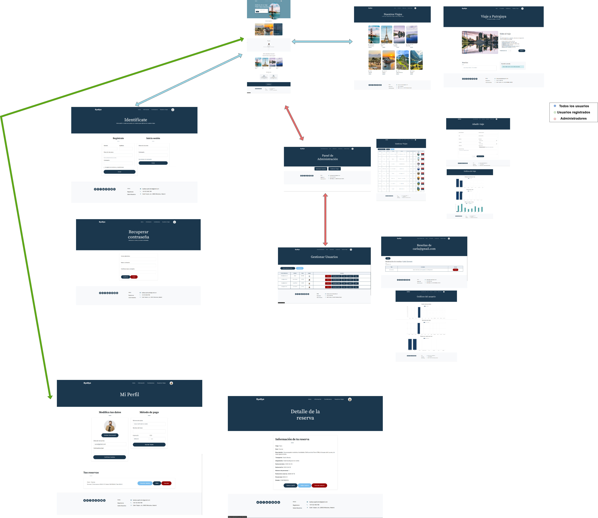
Sobre todo hemos actualizado las páginas en las cuales se puede acceder desde la cuenta del administrador. Teniendo en cuenta los gráficos de gestión de usuarios y gestión de viajes, los cuales nos proporcionan diferentes datos sobre los usuarios y las reservas de los viajes que hacen en nuestra página.
También podemos apreciar la funcionalidad de recuperar la contraseña para los usuarios que no recuerden la actual y una página que permite al usuario poder consultar todos los detalles de su reserva.

#### **Capturas de Pantalla Actualizadas**

#### **1. Página de gráficos de los viajes**
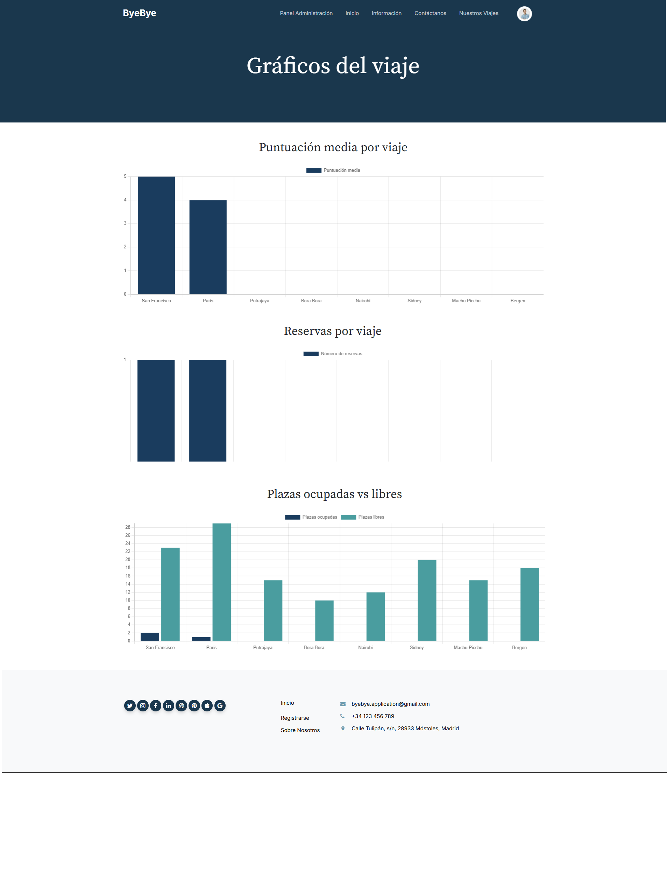
Estos gráficos nos proporcionan diferentes datos que nos hacen tomar referencia sobre los destinos más solicitados entre la comunidad de nuestros usuarios. También nos orientan sobre la disponibilidad de dichos viajes.

#### **2. Página de Lectura de reseñas siendo Admin**
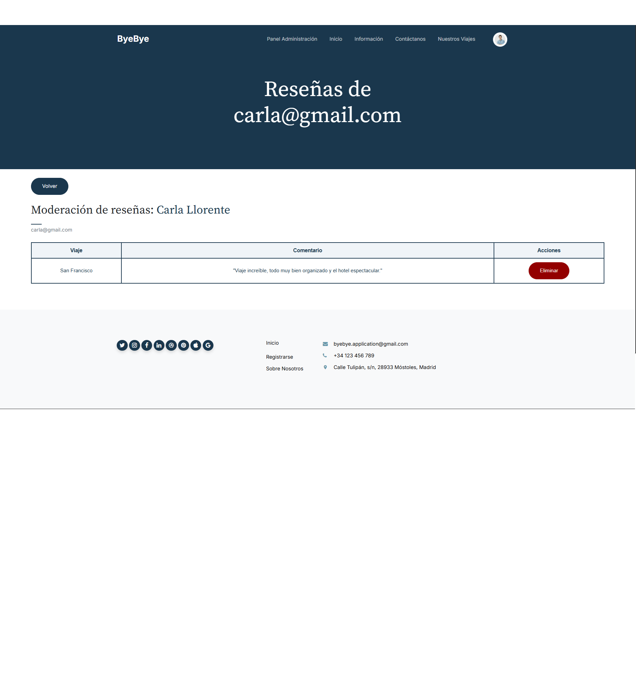
Esta nueva funcionalidad nos permite ser capaces de leer y borrar reseñas de nuestros usuarios (si accedemos desde la cuenta del administrador). 
Es una funcionalidad muy util para tener controlado las reseñas de nuestros usuarios y tener el poder de borrar algún comentario si es soez o falta el respeto de alguna manera.

#### **3. Página de Graficos de Usuarios siendo Admin**
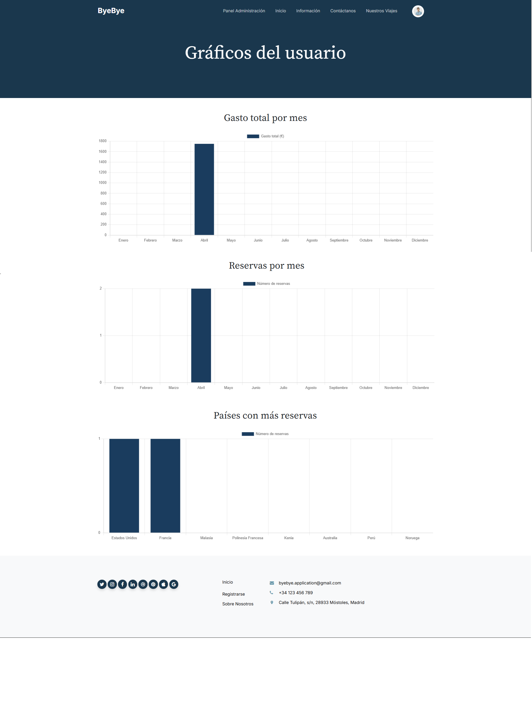
Este gráfico nos proporciona datos muy interesantes sobre los usuarios de nuestra web. Como sus gastos, su numero de reservas y los paises que suele reservar.


#### **4. Página de Añadir Viajes siendo Admin**
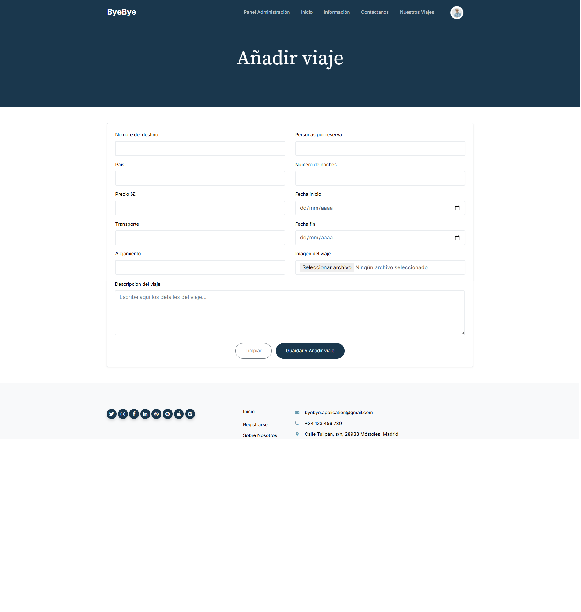
Esta funcionalidad permite al administrador gestionar la reserva de un viaje.

#### **5. Página de Recuperar Contraseña**
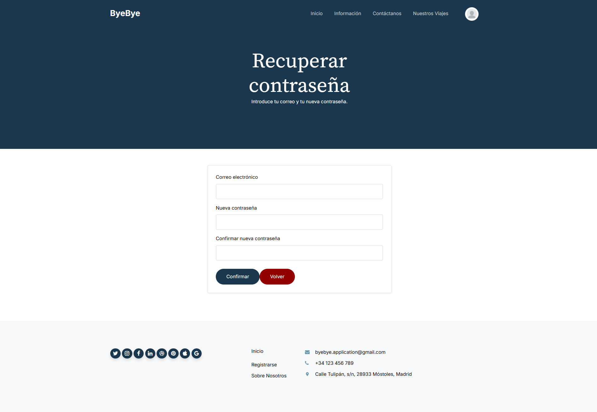
Esta funcionalidad permite al usuario poder cambiar su contraseña en el caso de que haya olvidado su contraseña actual.

#### **6. Página de Recuperar Contraseña**
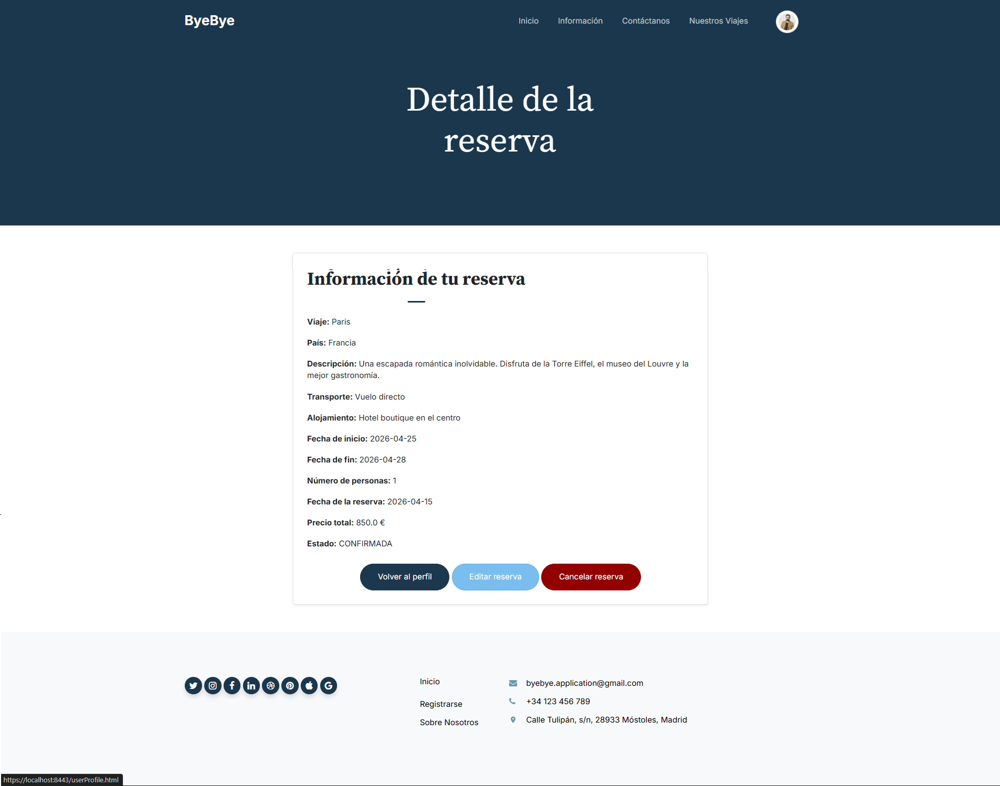
Esta funcionalidad permite al usuario poder consultar los datos de su reserva.


### **Instrucciones de Ejecución**

#### **Requisitos Previos**
- **Java**: versión 21 o superior
- **Maven**: versión 3.8 o superior
- **MySQL**: versión 8.0 o superior
- **Git**: para clonar el repositorio

#### **Pasos para ejecutar la aplicación**

1. **Clonar el repositorio**
   ```bash
   git clone https://github.com/[usuario]/[practica-ssdd-2025-26-grupo-2].git
   cd [nombre-repositorio]
   ```

2. **Accedemos a la carpeta backend**
    ```bash
    cd backend
    ```
3. **Ejecutamos la aplicacion**
    ```bash
    mvn spring-boot:run
    ```

#### **Credenciales de prueba**
- **Usuario Admin**: 

    correo electrónico: `admin@byebye.com`, contraseña: `admin123`
- **Usuarios Registrados**: 

    correo electrónico: `carla@gmail.com`, contraseña: `pass123`

    correo electrónico: `lucas@gmail.com`, contraseña: `pass123`

    correo electrónico: `lucia@gmail.com`, contraseña: `pass123`
### **Diagrama de Entidades de Base de Datos**

Diagrama mostrando las entidades, sus campos y relaciones:

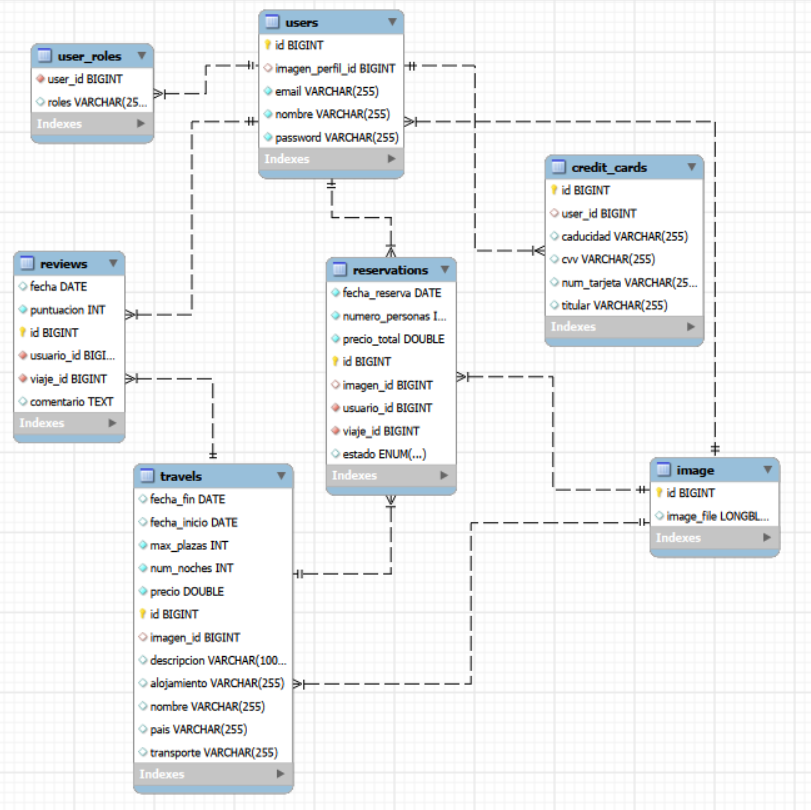


### **Diagrama de Clases y Templates**

Diagrama de clases de la aplicación con diferenciación por colores o secciones:


> [Descripción opcional del diagrama y relaciones principales]

### **Participación de Miembros en la Práctica 2**

#### **Alumno 1 - María Abdallah El Lakkis**

Durante el desarrollo del proyecto, participé activamente en la implementación de funcionalidades tanto en backend como en frontend. Me encargué del desarrollo del sistema de registro e inicio de sesión de usuarios, incluyendo la gestión de contraseñas encriptadas, así como de la implementación de funcionalidades relacionadas con el perfil de usuario, como la actualización de imágenes, la personalización de la interfaz y el registro de tarjetas bancarias. También trabajé en la creación de herramientas de administración de usuarios y en la implementación de un sistema de búsqueda que mejora la navegación y experiencia dentro de la aplicación.

Además, llevé a cabo la integración y conexión con la base de datos, asegurando la correcta persistencia y relación de los datos. Paralelamente, participé de forma continua en la revisión del código, detección y corrección de errores, contribuyendo a mejorar la estabilidad, el rendimiento y el correcto funcionamiento general del sistema.

| Nº    | Commits      | Files      |
|:------------: |:------------:| :------------:|
|1| [Registro de usuario realizado](https://github.com/CodeURJC-SSDD-2025-26/practica-ssdd-2025-26-grupo-2/commit/08c80865e549226cec93b533ee307fb37474a510)  | [SiginWebController.java](https://github.com/CodeURJC-SSDD-2025-26/practica-ssdd-2025-26-grupo-2/commit/08c80865e549226cec93b533ee307fb37474a510#diff-dc32c934f0e13611df37bc7aaa196b3bb19f9e7d600a81aa3c6e5b99bdd11896)     [UserService.java](https://github.com/CodeURJC-SSDD-2025-26/practica-ssdd-2025-26-grupo-2/commit/08c80865e549226cec93b533ee307fb37474a510#diff-8457d6a7465c0d8faebcdcf6cc4d702526ad86b10dbf60228a72fe0f38369b99) |
|2| [Inicio de sesión de usuarios con contraseñas encriptadas realizado](https://github.com/CodeURJC-SSDD-2025-26/practica-ssdd-2025-26-grupo-2/commit/2071b2728277a17bdf91860c6b46a366013eab67)| [WebSecurityConfig.java](https://github.com/CodeURJC-SSDD-2025-26/practica-ssdd-2025-26-grupo-2/commit/2071b2728277a17bdf91860c6b46a366013eab67#diff-415d09308ca7883a8ba6a0f07f805171dc663ca1dd18d612d5fa7582159852e7) [signin.html](https://github.com/CodeURJC-SSDD-2025-26/practica-ssdd-2025-26-grupo-2/commit/2071b2728277a17bdf91860c6b46a366013eab67#diff-3ec4ca9b76ee4b7cdcf3a4d13aaff51717ef233edb0ac76ff942fa1ee6c53699)   |
|3| [Post cambio de imagen realizado y userProfile y header modificados](https://github.com/CodeURJC-SSDD-2025-26/practica-ssdd-2025-26-grupo-2/commit/dbc6a6dbc6f30f959acc4779c3b2717e190f0201)  | [UserImageController.java](https://github.com/CodeURJC-SSDD-2025-26/practica-ssdd-2025-26-grupo-2/commit/dbc6a6dbc6f30f959acc4779c3b2717e190f0201#diff-1502704a0e359cbe5a07beaa1f33c5327ada3e2fcc76f2cdb4b386709e38e8f0) [userProfile.html](https://github.com/CodeURJC-SSDD-2025-26/practica-ssdd-2025-26-grupo-2/commit/dbc6a6dbc6f30f959acc4779c3b2717e190f0201#diff-cd0a43556d5cd2946e2ee0a4a409568b3e7f984829e78d046ba7436df8f3ae0b) [header.html](https://github.com/CodeURJC-SSDD-2025-26/practica-ssdd-2025-26-grupo-2/commit/dbc6a6dbc6f30f959acc4779c3b2717e190f0201#diff-3491f074e6ba69e27536cee967464b28761ec74a7837168942622c78b2d4c6c8)    |
|4| [gestion de usuarios desde el panel realizada](https://github.com/CodeURJC-SSDD-2025-26/practica-ssdd-2025-26-grupo-2/commit/80371ecf587ce84dd52bd02417e55c15ed45642c#diff-0d5b63f27f89cf7e7b30c2ae54141c80efddc80dcd4a976017ab302920b5c8f0)  | [UserManagementController.java](https://github.com/CodeURJC-SSDD-2025-26/practica-ssdd-2025-26-grupo-2/commit/80371ecf587ce84dd52bd02417e55c15ed45642c#diff-0d5b63f27f89cf7e7b30c2ae54141c80efddc80dcd4a976017ab302920b5c8f0) [userManagement.html](https://github.com/CodeURJC-SSDD-2025-26/practica-ssdd-2025-26-grupo-2/commit/80371ecf587ce84dd52bd02417e55c15ed45642c#diff-93d1b2bb3f0616970eef03386cb79bc957ea234bcf4d9e2f22ec07d8866aa9de)  |
|5| [buscador principal implementado](https://github.com/CodeURJC-SSDD-2025-26/practica-ssdd-2025-26-grupo-2/commit/827434439d795e7bf28ef7605a260039e602cb5d)  | [TripSearcherController.java](https://github.com/CodeURJC-SSDD-2025-26/practica-ssdd-2025-26-grupo-2/commit/827434439d795e7bf28ef7605a260039e602cb5d#diff-1d637d55f17f2507276eeb8b0f710d7925d9d751b51f9026a290c738118643f4)  [TravelRepository.java](https://github.com/CodeURJC-SSDD-2025-26/practica-ssdd-2025-26-grupo-2/commit/827434439d795e7bf28ef7605a260039e602cb5d#diff-a3a431c211c8e93418137a83475d3db93b3091d52e3d899e377707f5e4a6198b)  |

---

#### **Alumno 2 - Alejandro Hernández de Dios**

Me he ocupado principalmente de la correcta funcionalidad del apartado de las reseñas del usuario en cada viaje. Por un lado hice que solo los usuarios registrados puedan poner reseñas para así evitar falsos testimonios. También hice que una vez se cierra sesión con el usuario que usaste para poner una reseña esa reseña perdura en la web, apareciendo en la seccion de reseñas de la página principal (en donde también me ocupé de que las fotos de perfil del usuario propietario de dicha reseña, aparezca sin porblema en esa sección) y en el apartado de nuestros viajes en dicho viaje.

Centrándonos en la cuenta del administrador, le di utilidad al botón de reseñas que se encuentra en el panel de administración. 
Una vez haces click en Gestionar Usuarios se carga una pantalla en la cual puedes consultar todos los usuarios con una cuenta registrada dentro de la web. 
En cada ficha de usuario se encuentra este botón llamado Reseñas, el cual si accedes a el te carga una nueva pantalla en la cual puedes ver todo el registro de reseñas que ha escrito dicho usuario. Además, dentro de esta página, se encuentra la funcionalidad de poder eliminar la reseña de ese mismo usuario en caso de que el administrador lo encuentre necesario por temas como: faltas de respeto, lenguaje soez, entre otros...


| Nº    | Commits      | Files      |
|:------------: |:------------:| :------------:|
|1| [Descripción commit 1](URL_commit_1)  | [Archivo1](URL_archivo_1)   |
|2| [Descripción commit 2](URL_commit_2)  | [Archivo2](URL_archivo_2)   |
|3| [Descripción commit 3](URL_commit_3)  | [Archivo3](URL_archivo_3)   |
|4| [Descripción commit 4](URL_commit_4)  | [Archivo4](URL_archivo_4)   |
|5| [Descripción commit 5](URL_commit_5)  | [Archivo5](URL_archivo_5)   |

---

#### **Alumno 3 - [Nombre Completo]**

[Descripción de las tareas y responsabilidades principales del alumno en el proyecto]

| Nº    | Commits      | Files      |
|:------------: |:------------:| :------------:|
|1| [Descripción commit 1](URL_commit_1)  | [Archivo1](URL_archivo_1)   |
|2| [Descripción commit 2](URL_commit_2)  | [Archivo2](URL_archivo_2)   |
|3| [Descripción commit 3](URL_commit_3)  | [Archivo3](URL_archivo_3)   |
|4| [Descripción commit 4](URL_commit_4)  | [Archivo4](URL_archivo_4)   |
|5| [Descripción commit 5](URL_commit_5)  | [Archivo5](URL_archivo_5)   |

---

#### **Alumno 4 - Yadira Reimúndez Queimadelos**

He sido responsable principalmente de la gestión de reservas dentro del proyecto, tanto en la parte del usuario como en la del administrador, desarrollando la lógica necesaria para crear, visualizar, editar, cancelar y administrar las reservas en la aplicación.

Además, me he encargado de adaptar los gráficos para que reflejen correctamente la información existente en la base de datos, asegurando que los datos mostrados fuesen coherentes con el estado real del sistema.

También desarrollé la lógica del sistema de correo vinculada al apartado de contacto, de forma que cualquier duda, consulta o petición enviada por un usuario llegase correctamente al correo correspondiente.

Por otro lado, participé en la implementación de algunas páginas de error y en la funcionalidad de cambio o recuperación de contraseña para los usuarios que la hubiesen olvidado.

| Nº    | Commits      | Files      |
|:------------: |:------------:| :------------:|
|1| [entidades reserva, usuario y viaje](https://github.com/CodeURJC-SSDD-2025-26/practica-ssdd-2025-26-grupo-2/commit/a6ce53c85430f24016cdfeea416f3cdf1e7dfa02)  | [backend/src/main/java/com/ssdd/backend/model](https://github.com/CodeURJC-SSDD-2025-26/practica-ssdd-2025-26-grupo-2/commit/a6ce53c85430f24016cdfeea416f3cdf1e7dfa02)   |
|2| [Lógica de la reserva de viajes hecha](https://github.com/CodeURJC-SSDD-2025-26/practica-ssdd-2025-26-grupo-2/commit/bc10480da683b601b26fecffc9c4fec04b907850)  | [backend/src/main/java/com/ssdd/backend/controller/ReservationWebController.java](https://github.com/CodeURJC-SSDD-2025-26/practica-ssdd-2025-26-grupo-2/commit/bc10480da683b601b26fecffc9c4fec04b907850#diff-e7c50b4ce531d12d141a8b539a3fec023be1fbae53c0804e6cfe9f4cf0dc80ec)   |
|3| [Gráficas de usuario y gráficas viajes](https://github.com/CodeURJC-SSDD-2025-26/practica-ssdd-2025-26-grupo-2/commit/fef424c8aed60ff00f10771322d71aacebb7a74d)  | [backend/src/main/java/com/ssdd/backend/controller/GraphUserRestController.java](https://github.com/CodeURJC-SSDD-2025-26/practica-ssdd-2025-26-grupo-2/commit/fef424c8aed60ff00f10771322d71aacebb7a74d#diff-e50a8ea1100dfb4f1b645713cfc022d34b78707a2cc6a11ef8c70aecc4d053e5)   |
|4| [Correo para que nos puedan contactar](https://github.com/CodeURJC-SSDD-2025-26/practica-ssdd-2025-26-grupo-2/commit/80fce03cf059bdbd1f28c1d05108211ce926799c)  | [backend/src/main/java/com/ssdd/backend/service/EmailService.java](https://github.com/CodeURJC-SSDD-2025-26/practica-ssdd-2025-26-grupo-2/commit/80fce03cf059bdbd1f28c1d05108211ce926799c#diff-e6edb82576a7fb0fd8826bc7dbe3303c159a1f39d145b79c995bc155273d522d)   |
|5| [gestionar las reservas de un usuario siendo admin](https://github.com/CodeURJC-SSDD-2025-26/practica-ssdd-2025-26-grupo-2/commit/ba519411b1f46173a8a56f127c2657b0aa19753d)  | [backend/src/main/java/com/ssdd/backend/controller/ReservationWebController.java](https://github.com/CodeURJC-SSDD-2025-26/practica-ssdd-2025-26-grupo-2/commit/ba519411b1f46173a8a56f127c2657b0aa19753d#diff-e7c50b4ce531d12d141a8b539a3fec023be1fbae53c0804e6cfe9f4cf0dc80ec)   |

---

## 🛠 **Práctica 3: API REST, docker y despliegue**

### **Documentación de la API REST**

#### **Especificación OpenAPI**
📄 **[Especificación OpenAPI (YAML)](/api-docs/api-docs.yaml)**

#### **Documentación HTML**
📖 **[Documentación API REST (HTML)](https://raw.githack.com/[usuario]/[repositorio]/main/api-docs/api-docs.html)**

> La documentación de la API REST se encuentra en la carpeta `/api-docs` del repositorio. Se ha generado automáticamente con SpringDoc a partir de las anotaciones en el código Java.

### **Diagrama de Clases y Templates Actualizado**

Diagrama actualizado incluyendo los @RestController y su relación con los @Service compartidos:


### **Instrucciones de Ejecución con Docker**

#### **Requisitos previos:**
- Docker instalado (versión 20.10 o superior)
- Docker Compose instalado (versión 2.0 o superior)

#### **Pasos para ejecutar con docker-compose:**

1. **Clonar el repositorio** (si no lo has hecho ya):
   ```bash
   git clone https://github.com/[usuario]/[repositorio].git
   cd [repositorio]
   ```

2. **AQUÍ LOS SIGUIENTES PASOS**:

### **Construcción de la Imagen Docker**

#### **Requisitos:**
- Docker instalado en el sistema

#### **Pasos para construir y publicar la imagen:**

1. **Navegar al directorio de Docker**:
   ```bash
   cd docker
   ```

2. **AQUÍ LOS SIGUIENTES PASOS**

### **Despliegue en Máquina Virtual**

#### **Requisitos:**
- Acceso a la máquina virtual (SSH)
- Clave privada para autenticación
- Conexión a la red correspondiente o VPN configurada

#### **Pasos para desplegar:**

1. **Conectar a la máquina virtual**:
   ```bash
   ssh -i [ruta/a/clave.key] [usuario]@[IP-o-dominio-VM]
   ```
   
   Ejemplo:
   ```bash
   ssh -i ssh-keys/app.key vmuser@10.100.139.XXX
   ```

2. **AQUÍ LOS SIGUIENTES PASOS**:

### **URL de la Aplicación Desplegada**

🌐 **URL de acceso**: `https://[nombre-app].etsii.urjc.es:8443`

#### **Credenciales de Usuarios de Ejemplo**

| Rol | Usuario | Contraseña |
|:---|:---|:---|
| Administrador | admin | admin123 |
| Usuario Registrado | user1 | user123 |
| Usuario Registrado | user2 | user123 |

### **OTRA DOCUMENTACIÓN ADICIONAL REQUERIDA EN LA PRÁCTICA**

### **Participación de Miembros en la Práctica 3**

#### **Alumno 1 - [Nombre Completo]**

[Descripción de las tareas y responsabilidades principales del alumno en el proyecto]

| Nº    | Commits      | Files      |
|:------------: |:------------:| :------------:|
|1| [Descripción commit 1](URL_commit_1)  | [Archivo1](URL_archivo_1)   |
|2| [Descripción commit 2](URL_commit_2)  | [Archivo2](URL_archivo_2)   |
|3| [Descripción commit 3](URL_commit_3)  | [Archivo3](URL_archivo_3)   |
|4| [Descripción commit 4](URL_commit_4)  | [Archivo4](URL_archivo_4)   |
|5| [Descripción commit 5](URL_commit_5)  | [Archivo5](URL_archivo_5)   |

---

#### **Alumno 2 - [Nombre Completo]**

[Descripción de las tareas y responsabilidades principales del alumno en el proyecto]

| Nº    | Commits      | Files      |
|:------------: |:------------:| :------------:|
|1| [Descripción commit 1](URL_commit_1)  | [Archivo1](URL_archivo_1)   |
|2| [Descripción commit 2](URL_commit_2)  | [Archivo2](URL_archivo_2)   |
|3| [Descripción commit 3](URL_commit_3)  | [Archivo3](URL_archivo_3)   |
|4| [Descripción commit 4](URL_commit_4)  | [Archivo4](URL_archivo_4)   |
|5| [Descripción commit 5](URL_commit_5)  | [Archivo5](URL_archivo_5)   |

---

#### **Alumno 3 - [Nombre Completo]**

[Descripción de las tareas y responsabilidades principales del alumno en el proyecto]

| Nº    | Commits      | Files      |
|:------------: |:------------:| :------------:|
|1| [Descripción commit 1](URL_commit_1)  | [Archivo1](URL_archivo_1)   |
|2| [Descripción commit 2](URL_commit_2)  | [Archivo2](URL_archivo_2)   |
|3| [Descripción commit 3](URL_commit_3)  | [Archivo3](URL_archivo_3)   |
|4| [Descripción commit 4](URL_commit_4)  | [Archivo4](URL_archivo_4)   |
|5| [Descripción commit 5](URL_commit_5)  | [Archivo5](URL_archivo_5)   |

---

#### **Alumno 4 - [Nombre Completo]**

[Descripción de las tareas y responsabilidades principales del alumno en el proyecto]

| Nº    | Commits      | Files      |
|:------------: |:------------:| :------------:|
|1| [Descripción commit 1](URL_commit_1)  | [Archivo1](URL_archivo_1)   |
|2| [Descripción commit 2](URL_commit_2)  | [Archivo2](URL_archivo_2)   |
|3| [Descripción commit 3](URL_commit_3)  | [Archivo3](URL_archivo_3)   |
|4| [Descripción commit 4](URL_commit_4)  | [Archivo4](URL_archivo_4)   |
|5| [Descripción commit 5](URL_commit_5)  | [Archivo5](URL_archivo_5)   |

---
